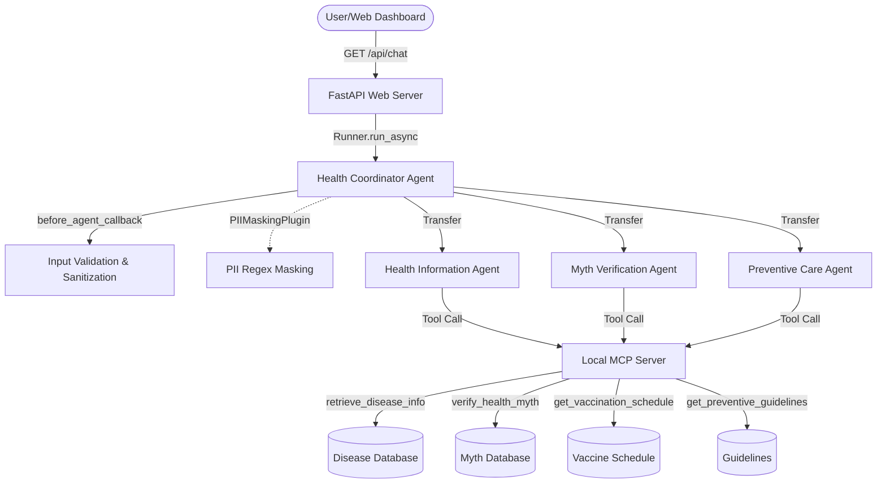

# HealthGuard - Public Health Awareness Agent System

HealthGuard is a trusted public health assistant. It simplifies medical terminology, identifies and debunks health myths, provides vaccination schedules, and suggests healthy habits.

HealthGuard is designed with **privacy-first security layers**, including input validation and automated PII masking, and features a clean, responsive single-page web application.

---

## 📋 The Problem & The Solution

### The Problem
*   **Health Misinformation**: Misconceptions (e.g., "antibiotics cure viral infections") spread quickly, leading to unsafe self-treatment.
*   **Complex Terminology**: Medical details are often written in jargon, making them hard for the general public to understand.
*   **Privacy & Data Leaks**: Medical queries often contain sensitive Personal Identifiable Information (PII) like email addresses, phone numbers, or social security numbers, which should never be exposed in model logs or persistent storage.
*   **Prompt/Script Injections**: Remote chat portals are vulnerable to injection attacks (XSS, instruction overrides).

### The Solution
*   **Multi-Agent Coordination**: A central coordinator delegates tasks to specialized sub-agents (Health Information, Myth Verification, Preventive Care).
*   **MCP Grounding**: Sub-agents query a local Model Context Protocol (MCP) server for verified medical records, avoiding hallucinations.
*   **PII Masking & Input Validation**: Security hooks sanitize inputs for dangerous scripts and strip PII in transit before queries hit the LLMs.
*   **Non-Persistent Storage**: Conversation states are stored in-memory and can be manually cleared with a click.

---

## 🕸️ System Architecture

*Detailed technical documentation is available in [architecture.md](architecture.md).*

HealthGuard is structured around a coordinator-delegator pattern:

### Agents Role Definitions
1.  **Health Coordinator Agent**: Receives user inputs, runs security checks, routes control to the appropriate sub-agent, and appends clinical disclaimers.
2.  **Health Information Agent**: Explains symptoms, causes, and when to seek medical help. Binds to `retrieve_disease_info`.
3.  **Myth Verification Agent**: Compares claims against clinical databases and details scientific consensus. Binds to `verify_health_myth`.
4.  **Preventive Care Agent**: Provides child and adult vaccination schedules and healthy living guidelines. Binds to `get_vaccination_schedule` and `get_preventive_guidelines`.

---

## 🛡️ Security & Privacy Compliance

*   **Prompt & Script Sanitization**: The `before_agent_callback` runs validation checks rejecting basic script tags (`<script>`), source loaders (`onload`, `onerror`), and prompt bypass keywords.
*   **Automated PII Redaction**: The `PIIMaskingPlugin` intercepts LLM payloads and event streams. Any email addresses, phone numbers, or SSNs are instantly replaced with `[EMAIL_MASKED]`, `[PHONE_MASKED]`, and `[SSN_MASKED]`.
*   **Ephemeral Data Retention**: Configured with `InMemorySessionService` to ensure that conversation histories are kept only in RAM.
*   **Reset Button**: Clears the current session and wipes in-memory data.

---

