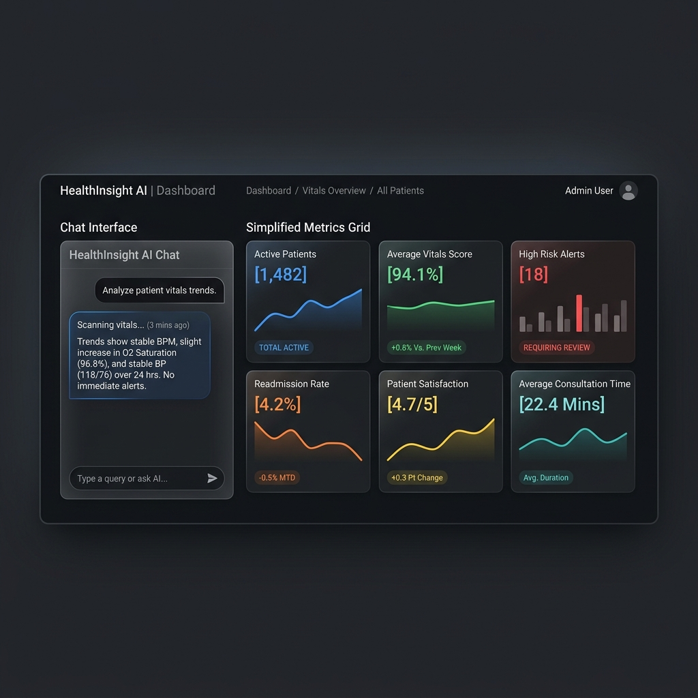
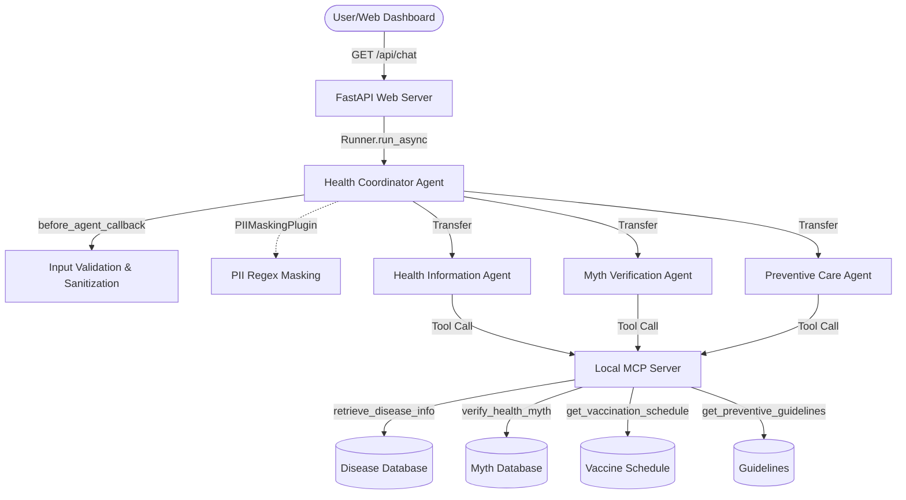
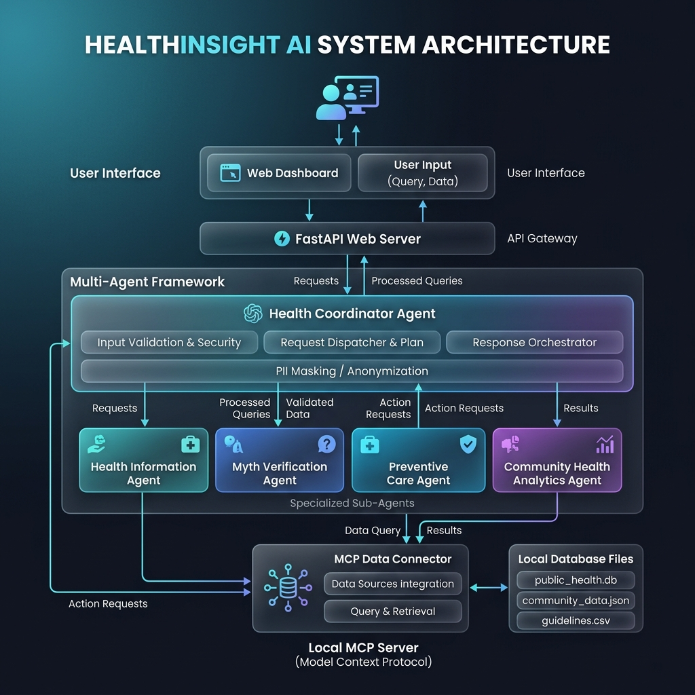

# HealthInsight AI – Public Health Awareness Agent

HealthInsight AI is a trusted public health assistant built using **Google's Agent Development Kit (ADK)**. It simplifies medical terminology, identifies and debunks health myths, provides vaccination schedules, and suggests healthy habits.

HealthInsight AI is designed with **privacy-first security layers**, including input validation and automated PII masking, and features a clean, responsive single-page web application.



---

## 📋 The Problem & The Solution

### The Problem
*   **Health Misinformation**: Misconceptions (e.g., "antibiotics cure viral infections") spread quickly, leading to unsafe self-treatment.
*   **Complex Terminology**: Medical details are often written in jargon, making them hard for the general public to understand.
*   **Privacy & Data Leaks**: Medical queries often contain sensitive Personal Identifiable Information (PII) like email addresses, phone numbers, or social security numbers, which should never be exposed in model logs or persistent storage.
*   **Prompt/Script Injections**: Remote chat portals are vulnerable to injection attacks (XSS, instruction overrides).

### The Solution
*   **Multi-Agent Coordination**: A central coordinator delegates tasks to specialized sub-agents (Health Information, Myth Verification, Preventive Care).
*   **MCP Grounding**: Sub-agents query a local Model Context Protocol (MCP) server for verified medical records, avoiding hallucinations.
*   **PII Masking & Input Validation**: Security hooks sanitize inputs for dangerous scripts and strip PII in transit before queries hit the LLMs.
*   **Non-Persistent Storage**: Conversation states are stored in-memory and can be manually cleared with a click.

---

## 🕸️ System Architecture

*Detailed technical documentation is available in [architecture.md](architecture.md).*

HealthInsight AI is structured around a coordinator-delegator pattern:






### Agents Role Definitions
1.  **Health Coordinator Agent**: Receives user inputs, runs security checks, routes control to the appropriate sub-agent, and appends clinical disclaimers.
2.  **Health Information Agent**: Explains symptoms, causes, and when to seek medical help. Binds to `retrieve_disease_info`.
3.  **Myth Verification Agent**: Compares claims against clinical databases and details scientific consensus. Binds to `verify_health_myth`.
4.  **Preventive Care Agent**: Provides child and adult vaccination schedules and healthy living guidelines. Binds to `get_vaccination_schedule` and `get_preventive_guidelines`.
5.  **Community Health Analytics Agent**: Analyzes community health datasets, detects disease trends, calculates regional risk profiles, and provides data-driven public health recommendations. Binds to `analyze_health_trends`, `predict_health_risk`, and `generate_health_recommendations`.

---

## 🧠 Decision Intelligence Extension

HealthInsight AI has been extended with a Public Health Decision Intelligence framework:
*   **Grounded Data Processing**: Computes metrics from [community_health_data.csv](file:///c:/Users/sc/Documents/Capstone_project/health-agent/app/data/community_health_data.csv) containing realistic reports across Wards 1-4 for Dengue, Influenza, Diabetes, and Heat Stroke.
*   **Trend & Risk Engine**: Uses lightweight Pandas rule-based analytics to identify case escalations and classify risk levels (High Risk for MoM increase >25%, Medium for <=25%, Low for stable or decreasing).
*   **Dynamic Visual Dashboard**: Displays active KPI indicators and renders a multi-line Chart.js chart tracking cases over time and disease trends by region.

---

## 🛡️ Security & Privacy Compliance

*   **Prompt & Script Sanitization**: The `before_agent_callback` runs validation checks rejecting basic script tags (`<script>`), source loaders (`onload`, `onerror`), and prompt bypass keywords.
*   **Automated PII Redaction**: The `PIIMaskingPlugin` intercepts LLM payloads and event streams. Any email addresses, phone numbers, or SSNs are instantly replaced with `[EMAIL_MASKED]`, `[PHONE_MASKED]`, and `[SSN_MASKED]`.
*   **Ephemeral Data Retention**: Configured with `InMemorySessionService` to ensure that conversation histories are kept only in RAM.
*   **Reset Button**: Clears the current session and wipes in-memory data.

---

## ⚙️ Setup & Local Running Instructions

### Prerequisites
*   Python 3.11 or 3.12
*   [Astral uv](https://docs.astral.sh/uv/) python package manager installed

### 1. Installation
Clone the repository and run dependencies installation inside the project folder:
```bash
cd health-agent
agents-cli install
```

### 2. Environment Configuration
Create a `.env` file in the root directory and write your Gemini API key:
```env
GEMINI_API_KEY=YOUR_GEMINI_API_KEY
GOOGLE_GENAI_USE_VERTEXAI=False
```

### 3. Run Automated Tests
Execute the unit test suite to verify security masking and validation behavior:
```bash
uv run pytest tests/unit/test_health_agent.py
```

### 4. Start the Application
Run the startup script:
```bash
uv run python run_app.py
```
This starts the FastAPI web server on `http://127.0.0.1:8000/` and opens the dashboard in your default browser automatically.

---

## 🔗 REST API Endpoints

*   **`GET /api/chat?query=<prompt>&session_id=<session_id>`**
    Streams real-time execution events, routing handovers, tool calling, and token streams using Server-Sent Events (SSE).
*   **`GET /api/session/clear?session_id=<session_id>`**
    Deletes all session context, chat history, and variables in the server's memory.
