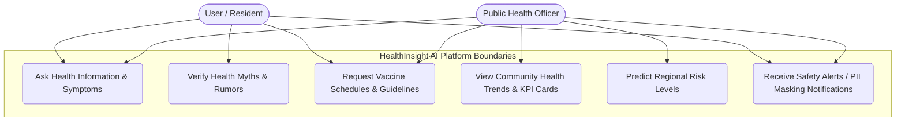
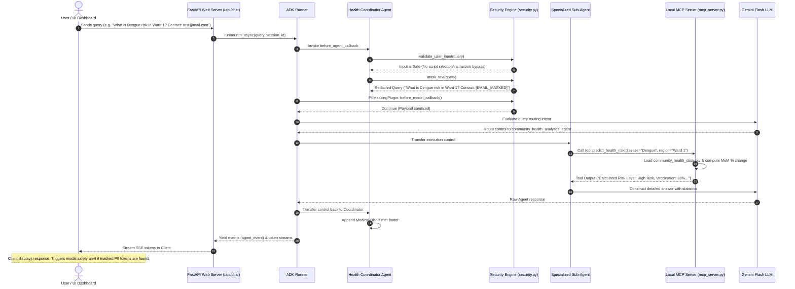

# HealthInsight AI – Use Cases and Process Flows

This document details the system's functional boundaries (Use Case Diagram) and runtime execution sequence (Process Flow Sequence Diagram).

---

## 👥 Use Case Diagram

The use case diagram illustrates the roles of two key actors (General Users/Residents and Public Health Officers) and their interactions with the platform's core boundaries.

---

## 🔄 Process Flow Diagram (Sequence Diagram)

The sequence diagram details the step-by-step transaction flow from the moment a client query hits the web server, showing validation, masking, routing, grounding, and response streaming.

