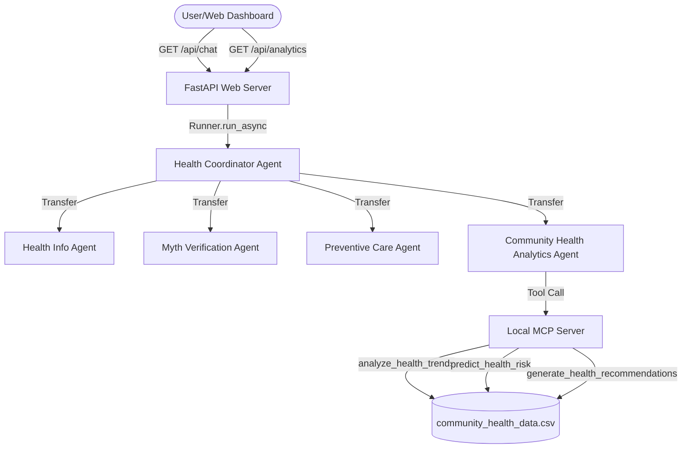

# Implementation Plan: HealthInsight AI Decision Intelligence Extension

This plan details the steps to enhance **HealthInsight AI** into a Public Health Decision Intelligence Platform. We will add a new specialized agent, a realistic CSV community health dataset, Pandas-based trend and risk prediction tools, an API endpoint, and a Chart.js dashboard extension—without breaking any of the existing Public Health Awareness functionalities.

---

## User Review Required

Please review the following design decisions:

1. **Dependency Addition**: We will add `pandas` to the dependencies in `pyproject.toml` to perform trend analysis and risk computations. We will install it using:
   ```bash
   uv add pandas
   ```
2. **Chart.js CDN**: We will import the lightweight Chart.js library from a trusted CDN (e.g., `https://cdn.jsdelivr.net/npm/chart.js`) in `app/static/index.html` to render line charts.
3. **Dataset Location**: The CSV file will be created at [app/data/community_health_data.csv](file:///c:/Users/sc/Documents/Capstone_project/health-agent/app/data/community_health_data.csv) for easy packaging and accessibility by the MCP server.

---

## Proposed Architecture

We will add a new agent, `community_health_analytics_agent`, and bind it to the new analytics tools:



---

## Open Questions

> [!NOTE]
> There are no unresolved open questions. We will use a rule-based logic for risk classification (cases increase >25% -> High Risk, <=25% -> Medium Risk, stable/decreasing -> Low Risk) as specified.

---

## Proposed Changes

We will introduce the new features across the project structure:

### 1. Dataset & Analytics Tools

#### [NEW] [community_health_data.csv](file:///c:/Users/sc/Documents/Capstone_project/health-agent/app/data/community_health_data.csv)
A CSV containing realistic public health statistics with columns: `date`, `region`, `disease`, `cases`, `vaccination_rate`.
It will contain 30–50 rows mapping dates over the last few months for:
*   **Diseases**: Dengue, Influenza, Diabetes, Heat Stroke
*   **Wards**: Ward 1, Ward 2, Ward 3, Ward 4

#### [MODIFY] [mcp_server.py](file:///c:/Users/sc/Documents/Capstone_project/health-agent/app/mcp_server.py)
Register the new tools on the FastMCP instance:
*   `analyze_health_trends() -> str`: Reads the CSV, aggregates cases by disease and region, identifies highest-risk region/disease, and returns a summary.
*   `predict_health_risk(disease: str, region: str) -> str`: Compares latest period cases to previous period cases. Returns High Risk (>25% increase), Medium Risk (<=25% increase), or Low Risk.
*   `generate_health_recommendations(disease: str, risk_level: str) -> str`: Returns targeted action items (e.g., mosquito control, hydration advisories, vaccine campaigns).

---

### 2. Multi-Agent & Routing Updates

#### [MODIFY] [agent.py](file:///c:/Users/sc/Documents/Capstone_project/health-agent/app/agent.py)
*   Define the `community_health_analytics_agent` with instructions to use the new tools (`analyze_health_trends`, `predict_health_risk`, `generate_health_recommendations`).
*   Update the `health_coordinator_agent` instructions to route requests like "Analyze community health data", "Show disease trends", "Predict dengue risk" to `community_health_analytics_agent`.
*   Include the new agent in the `sub_agents` list of the coordinator.

---

### 3. Backend API & Dashboard UI

#### [MODIFY] [web_server.py](file:///c:/Users/sc/Documents/Capstone_project/health-agent/app/web_server.py)
*   Add a `GET /api/analytics` endpoint that parses the CSV and computes:
    *   `total_cases`: Total cases across all periods.
    *   `highest_risk_region`: Region with the highest aggregate cases.
    *   `average_vaccination_rate`: Average of the `vaccination_rate` column.
    *   `risk_level`: Computed system risk level.
    *   `recommendations`: List of active recommendations.
    *   `trend_data`: Monthly aggregates for Chart.js charting.

#### [MODIFY] [index.html](file:///c:/Users/sc/Documents/Capstone_project/health-agent/app/static/index.html)
*   Include Chart.js library via CDN script tag.
*   Add an "Analytics & Trends Dashboard" section with panels displaying KPIs (Total Cases, Highest Risk Region, Average Vaccination Rate, Current Risk Level) and a canvas for the trend line chart.

#### [MODIFY] [style.css](file:///c:/Users/sc/Documents/Capstone_project/health-agent/app/static/style.css)
*   Add layout styles for the Analytics dashboard grid, metrics cards, and Chart.js container, maintaining glassmorphism and the dark theme.

#### [MODIFY] [app.js](file:///c:/Users/sc/Documents/Capstone_project/health-agent/app/static/app.js)
*   Add logic to fetch data from `/api/analytics` on load.
*   Render the KPI cards dynamically.
*   Initialize and update the Chart.js line chart showing case counts over time grouped by disease/region.

---

### 4. Documentation & Dependencies

#### [MODIFY] [pyproject.toml](file:///c:/Users/sc/Documents/Capstone_project/health-agent/pyproject.toml)
*   Add `pandas` to the dependencies block.

#### [MODIFY] [README.md](file:///c:/Users/sc/Documents/Capstone_project/health-agent/README.md)
*   Add a **Decision Intelligence Extension** section explaining trend analysis, risk prediction, and recommendation engines.

---

## Verification Plan

### Automated Tests
1. **Unit Tests**:
   Update `tests/unit/test_health_agent.py` to verify:
   *   Analytics tool executions (`analyze_health_trends`, `predict_health_risk`).
   *   Importing the new agent and routing configuration in `agent.py`.
   Run:
   ```bash
   uv run pytest tests/unit/test_health_agent.py
   ```

### Manual Verification
1. Run `uv run python run_app.py` and open the browser.
2. Confirm the analytics panel loads with dynamic statistics and a rendering Chart.js line chart.
3. In chat, test:
   *   "Analyze community health data for Ward 1" -> Verify routing to `community_health_analytics_agent` and correct tools execution.
   *   "What is the risk of Influenza in Ward 2?" -> Verify risk level prediction returns (Low/Medium/High) along with recommendations.
